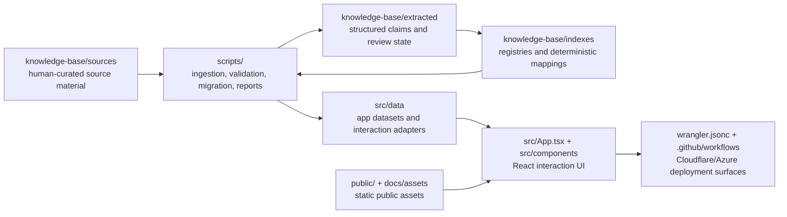

# EntheoGen Repository Layout

This guide describes the source-controlled repository layout contributors and
automation should expect in this repo today. It focuses on checked-in project
structure and intentionally omits generated/vendor files such as `node_modules/`,
`dist/`, `.git/`, `.DS_Store`, local secrets, and cache output.

## System Map



## Repository Tree

```text
EntheoGen/
|-- AGENTS.md                         # repo guidance for coding agents
|-- README.md                         # public project overview and quickstart
|-- README.txt                        # plain-text project overview copy
|-- LICENSE                           # MIT license
|-- package.json                      # npm scripts, runtime deps, dev tooling
|-- package-lock.json                 # locked npm dependency graph
|-- tsconfig.json                     # TypeScript compiler configuration
|-- vite.config.ts                    # Vite app and Cloudflare plugin config
|-- wrangler.jsonc                    # Cloudflare deployment configuration
|-- index.html                        # Vite HTML entry point
|-- metadata.json                     # project metadata consumed by tooling
|-- entheogen-release-image-1.png     # root-level release image asset
|
|-- src/                              # application source and shipped datasets
|   |-- main.tsx                      # React/Vite bootstrap
|   |-- App.tsx                       # primary interaction-guide UI shell
|   |-- index.css                     # global styles
|   |-- unknown.csv                   # source data artifact for unknown cases
|   |-- components/                   # reusable React UI components
|   |   `-- ResearchModePanel.tsx
|   |-- data/                         # normalized interaction data layer
|   |   |-- aggregateNodeDecomposition.ts
|   |   |-- drugData.ts
|   |   |-- evidenceEpistemics.ts
|   |   |-- formal_interaction_rule_layer.json
|   |   |-- interactionDataset.ts
|   |   |-- interactionDatasetV2.json
|   |   |-- interactionSchemaV2.ts
|   |   |-- priorityInteractionOverrides.ts
|   |   |-- researchMode.ts
|   |   |-- sourceLinking.ts
|   |   |-- substances_snapshot.json
|   |   `-- uiInteractions.ts
|   |-- services/                     # external service clients
|   |   `-- geminiService.ts
|   |-- types/                        # TypeScript ambient declarations
|   |   |-- assets.d.ts
|   |   `-- markdown.d.ts
|   |-- exports/                      # generated/exported interaction artifacts
|   |   `-- interaction_pairs.json
|   |-- curation/                     # human-in-the-loop interaction updates
|   |   |-- interaction-updates.jsonl
|   |   |-- examples/
|   |   |-- nl-reports/
|   |   |   |-- incoming/
|   |   |   |-- parsed/
|   |   |   `-- failed/
|   |   `-- prompts/
|   `-- audit/                        # audit CSVs for evidence quality
|       |-- low-confidence.csv
|       `-- missing-evidence.csv
|
|-- knowledge-base/                   # evidence corpus and validation inputs
|   |-- README.md                     # knowledge-base operating notes
|   |-- archive/
|   |   `-- absorbed-updates/
|   |-- extracted/                    # machine-readable extracted knowledge
|   |   |-- claims/
|   |   |   |-- pending/
|   |   |   |-- reviewed/
|   |   |   `-- rejected/
|   |   |-- contraindications/
|   |   |-- mechanisms/
|   |   `-- risk-guidance/
|   |-- indexes/                      # registries used by deterministic tooling
|   |   |-- citation_registry.json
|   |   |-- deterministic-mappings.json
|   |   |-- source_manifest.json
|   |   `-- source_tags.json
|   |-- reports/                      # generated ingestion/consolidation reports
|   |   |-- alma_ingestion_report.json
|   |   |-- json_consolidation_report.json
|   |   |-- perplexity_ingestion_report.json
|   |   `-- provisional_interactions_insert_report.json
|   |-- schemas/                      # JSON schemas for KB artifacts
|   |   |-- claim.schema.json
|   |   `-- source.schema.json
|   `-- sources/                      # human-readable source documents
|       |-- Reference_List.md
|       |-- academic-papers/
|       |-- clinical-guidelines/
|       |-- expert-guidelines/
|       |-- legal-policy/
|       |-- pharmacology-reference/
|       `-- traditional-contexts/
|
|-- scripts/                          # operational scripts and validation suite
|   |-- buildAppDatasetFromBeta.ts
|   |-- migrateInteractionsToV2.ts
|   |-- validateInteractionsV2.ts
|   |-- validateKnowledgeBase.ts
|   |-- testUIInteractionsAdapter.ts
|   |-- testProvisionalInteractions.ts
|   |-- ingest_alma_interactions.ts
|   |-- ingest_perplexity_research.ts
|   |-- extract_claims.ts
|   |-- promote_reviewed_claims.ts
|   |-- promote_eligible_reviewed_claims.ts
|   |-- link_claims_to_interactions.ts
|   |-- generateInteractionReports.ts
|   |-- parseInteractionReports.ts
|   |-- kb-utils.ts
|   |-- perplexity-utils.ts
|   `-- run_kb_tests.ts
|
|-- docs/                             # contributor and project documentation
|   |-- REPO_LAYOUT.md                # this repository layout guide
|   |-- AUTOMATION_WORKFLOW.md        # automation scope and review boundaries
|   |-- automation/
|   |   |-- SUBMISSION_HOW_TO.md       # contributor/model/agent submission guide
|   |   |-- SUBMISSION_INTAKE_FLOW.md  # standard file-first intake path
|   |   `-- RAPID_MANUAL_INTAKE.md    # urgent manual interaction intake path
|   `-- assets/                       # README/demo/release media
|
|-- public/                           # static files served by the app
|   |-- public.html
|
|-- .github/                          # GitHub metadata and CI/CD
|   |-- FUNDING.yml
|   |-- PULL_REQUEST_TEMPLATE.md
|   |-- copilot-instructions.md
|   |-- ISSUE_TEMPLATE/
|   `-- workflows/
|       `-- azure-deploy.yml
|
`-- .cursor/                          # local Cursor hook state
```

## Primary Ownership Areas

| Area | Primary audience | Purpose |
| --- | --- | --- |
| `src/` | app developers, reviewers | React UI, normalized datasets, data adapters, service clients |
| `src/data/` | data-layer maintainers | UI-facing interaction model, app snapshots, and deterministic rule inputs |
| `src/curation/` | research/curation operators | Proposed interaction updates, natural-language report intake, parsing prompts |
| `knowledge-base/` | evidence reviewers, dataset maintainers | Source corpus, extracted claims, schemas, indexes, ingestion reports |
| `scripts/` | maintainers, automation operators | Dataset builds, migrations, validation, ingestion, report generation |
| `public/` and `docs/assets/` | project/comms owners | Static public assets, demo media, release visuals |
| `.github/` | maintainers | GitHub issue templates and deployment workflow metadata |
| `.cursor/` | local operators | Machine-local editor state; do not treat as product data |

## Data Surfaces

- Source surfaces live under `knowledge-base/`: source notes in `sources/`,
  schemas in `schemas/`, claim candidates in `extracted/`, and registries in
  `indexes/`.
- App export/runtime surfaces live under `src/data/` and `src/exports/`:
  `src/data/interactionDatasetV2.json`, adapter modules such as
  `src/data/uiInteractions.ts`, and exported interaction artifacts.
- Scripts move data between those surfaces. The usual verification commands are
  `npm run kb:validate`, `npm run validate:interactions:v2`, and `npm run lint`.

## Practical Data Path

```text
knowledge-base/sources/
  -> scripts/*ingest* and scripts/extract_claims.ts
  -> knowledge-base/extracted/
  -> knowledge-base/indexes/
  -> scripts/buildAppDatasetFromBeta.ts or migration/validation scripts
  -> src/data/interactionDatasetV2.json and src/exports/interaction_pairs.json
  -> src/data/uiInteractions.ts
  -> src/App.tsx and src/components/
```

## Conventions For Adding Files

- Put user-facing app behavior in `src/`, with UI normalization centered in
  `src/data/uiInteractions.ts`.
- Put evidence sources, claim artifacts, schemas, and generated KB reports under
  `knowledge-base/`.
- Put repeatable operational work in `scripts/`, then expose it through
  `package.json` when it becomes part of the standard workflow.
- Put stakeholder-facing docs in `docs/`.
- Keep secrets in local environment files only. Do not commit live credentials,
  API keys, private tokens, or personal machine paths.

## Acceptance Criteria

- New paths named in docs exist in the repo or are clearly marked as planned.
- Source-surface changes under `knowledge-base/` pass `npm run kb:validate`.
- App data changes under `src/data/` pass `npm run validate:interactions:v2`.
- TypeScript or UI behavior changes pass `npm run lint`, plus focused tests when
  a touched script already has a test entry.

## Residual Limits

This file is a human-readable map, not an automated manifest. If the tree drifts,
update this guide in the same PR as the structural change or call out the drift
for reviewer follow-up.
