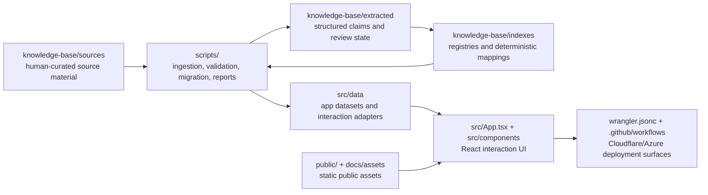

# EntheoGen Repository Layout

This is the canonical folder and file schematic for contributors, reviewers,
automation operators, and project stakeholders. It focuses on source-controlled
project structure and intentionally omits generated/vendor files such as
`node_modules/`, `dist/`, `.git/`, `.DS_Store`, local secrets, and cache output.

## System Map



## Canonical Tree

```text
EntheoGen/
├── AGENTS.md                         # repo guidance for coding agents
├── README.md                         # public project overview and quickstart
├── README.txt                        # plain-text project overview copy
├── LICENSE                           # MIT license
├── package.json                      # npm scripts, runtime deps, dev tooling
├── package-lock.json                 # locked npm dependency graph
├── tsconfig.json                     # TypeScript compiler configuration
├── vite.config.ts                    # Vite app and Cloudflare plugin config
├── wrangler.jsonc                    # Cloudflare deployment configuration
├── index.html                        # Vite HTML entry point
├── metadata.json                     # project metadata consumed by tooling
├── entheogen-release-image-1.png     # root-level release image asset
│
├── src/                              # application source and shipped datasets
│   ├── main.tsx                      # React/Vite bootstrap
│   ├── App.tsx                       # primary interaction-guide UI shell
│   ├── index.css                     # global styles
│   ├── unknown.csv                   # source data artifact for unknown cases
│   ├── assets/                       # app-bundled image assets
│   │   ├── logo-jaguar.png
│   │   ├── logo-leaf.png
│   │   └── logo-vine.png
│   ├── components/                   # reusable React UI components
│   │   └── ResearchModePanel.tsx
│   ├── data/                         # normalized interaction data layer
│   │   ├── aggregateNodeDecomposition.ts
│   │   ├── drugData.ts
│   │   ├── evidenceEpistemics.ts
│   │   ├── formal_interaction_rule_layer.json
│   │   ├── interactionDataset.ts
│   │   ├── interactionDatasetV2.json
│   │   ├── interactionSchemaV2.ts
│   │   ├── priorityInteractionOverrides.ts
│   │   ├── researchMode.ts
│   │   ├── sourceLinking.ts
│   │   ├── substances_snapshot.json
│   │   └── uiInteractions.ts
│   ├── services/                     # external service clients
│   │   └── geminiService.ts
│   ├── types/                        # TypeScript ambient declarations
│   │   ├── assets.d.ts
│   │   └── markdown.d.ts
│   ├── exports/                      # generated/exported interaction artifacts
│   │   └── interaction_pairs.json
│   ├── curation/                     # human-in-the-loop interaction updates
│   │   ├── interaction-updates.jsonl
│   │   ├── examples/
│   │   ├── nl-reports/
│   │   │   ├── incoming/
│   │   │   ├── parsed/
│   │   │   └── failed/
│   │   └── prompts/
│   └── audit/                        # audit CSVs for evidence quality
│       ├── low-confidence.csv
│       └── missing-evidence.csv
│
├── knowledge-base/                   # evidence corpus and validation inputs
│   ├── README.md                     # knowledge-base operating notes
│   ├── archive/
│   │   └── absorbed-updates/
│   ├── extracted/                    # machine-readable extracted knowledge
│   │   ├── claims/
│   │   │   ├── pending/
│   │   │   ├── reviewed/
│   │   │   └── rejected/
│   │   ├── contraindications/
│   │   ├── mechanisms/
│   │   └── risk-guidance/
│   ├── indexes/                      # registries used by deterministic tooling
│   │   ├── citation_registry.json
│   │   ├── deterministic-mappings.json
│   │   ├── source_manifest.json
│   │   └── source_tags.json
│   ├── reports/                      # generated ingestion/consolidation reports
│   │   ├── alma_ingestion_report.json
│   │   ├── json_consolidation_report.json
│   │   ├── perplexity_ingestion_report.json
│   │   └── provisional_interactions_insert_report.json
│   ├── schemas/                      # JSON schemas for KB artifacts
│   │   ├── claim.schema.json
│   │   └── source.schema.json
│   └── sources/                      # human-readable source documents
│       ├── Reference_List.md
│       ├── academic-papers/
│       ├── clinical-guidelines/
│       ├── expert-guidelines/
│       ├── legal-policy/
│       ├── pharmacology-reference/
│       └── traditional-contexts/
│
├── scripts/                          # operational scripts and validation suite
│   ├── buildAppDatasetFromBeta.ts
│   ├── migrateInteractionsToV2.ts
│   ├── validateInteractionsV2.ts
│   ├── validateKnowledgeBase.ts
│   ├── testUIInteractionsAdapter.ts
│   ├── ingest_alma_interactions.ts
│   ├── ingest_perplexity_research.ts
│   ├── extract_claims.ts
│   ├── promote_reviewed_claims.ts
│   ├── link_claims_to_interactions.ts
│   ├── generateInteractionReports.ts
│   ├── parseInteractionReports.ts
│   ├── kb-utils.ts
│   ├── perplexity-utils.ts
│   └── slack/
│       ├── slackApi.ts
│       ├── slackEnv.ts
│       ├── slackPost.ts
│       └── slackApi.test.ts
│
├── docs/                             # contributor and project documentation
│   ├── REPO_LAYOUT.md                # this canonical schematic
│   ├── automation/
│   │   └── AUTOMATION_AGENTS.md      # live automation role boundaries
│   └── assets/                       # README/demo/release media
│
├── public/                           # static files served by the app
│   ├── favicon.png
│   ├── public.html
│   ├── entheogen/
│   │   ├── EntheoGen-volunteer-QR-code.jpg
│   │   ├── entheogen-asset-beta-0.1.gif
│   │   ├── entheogen-flyer-guide.jpg
│   │   ├── entheogen-flyer-guide.pdf
│   │   ├── entheogen-help.jpg
│   │   └── entheogen-help.pdf
│   └── neurophenom-ai/
│       └── logo-neurophenom-ai.png
│
├── .github/                          # GitHub metadata and CI/CD
│   ├── FUNDING.yml
│   ├── copilot-instructions.md
│   ├── ISSUE_TEMPLATE/
│   └── workflows/
│       └── azure-deploy.yml
│
├── .cursor/                          # local Cursor hook state
├── .omx/                             # local oh-my-codex runtime state/logs
├── .wrangler/                        # local Wrangler generated state
│
├── AUTOMATION_README.md              # automation overview
├── AUTOMATION_GOVERNANCE.md          # automation governance policy
└── AUTOMATION_PHASE_1_BACKLOG.md     # automation rollout backlog
```

## Primary Ownership Areas

| Area | Primary audience | Purpose |
| --- | --- | --- |
| `src/` | app developers, reviewers | React UI, normalized datasets, data adapters, service clients |
| `src/data/` | data-layer maintainers | Canonical UI-facing interaction model and deterministic rule inputs |
| `src/curation/` | research/curation operators | Proposed interaction updates, natural-language report intake, parsing prompts |
| `knowledge-base/` | evidence reviewers, dataset maintainers | Source corpus, extracted claims, schemas, indexes, ingestion reports |
| `scripts/` | maintainers, automation operators | Dataset builds, migrations, validation, ingestion, report generation |
| `docs/automation/` | automation maintainers | Live automation roles, boundaries, output contracts, approval constraints |
| `public/` and `docs/assets/` | project/comms owners | Static public assets, demo media, release visuals |
| `.github/` | maintainers | GitHub issue templates and deployment workflow metadata |
| `.omx/`, `.cursor/`, `.wrangler/` | local operators | Machine-local runtime/cache state; do not treat as canonical product data |

## Canonical Data Path

```text
knowledge-base/sources/
  -> scripts/*ingest* and scripts/extract_claims.ts
  -> knowledge-base/extracted/
  -> knowledge-base/indexes/
  -> scripts/buildAppDatasetFromBeta.ts or migration/validation scripts
  -> src/data/interactionDatasetV2.json and related adapters
  -> src/data/uiInteractions.ts
  -> src/App.tsx and src/components/
```

## Conventions For Adding Files

- Put user-facing app behavior in `src/`, with UI normalization centered in
  `src/data/uiInteractions.ts`.
- Put evidence sources, claim artifacts, schemas, and generated KB reports under
  `knowledge-base/`.
- Put repeatable operational work in `scripts/`, then expose it through
  `package.json` when it becomes part of the standard workflow.
- Put stakeholder-facing docs in `docs/`; keep automation-specific docs in
  `docs/automation/`.
- Keep secrets in local environment files only. Do not commit live credentials,
  API keys, private tokens, or personal machine paths.
